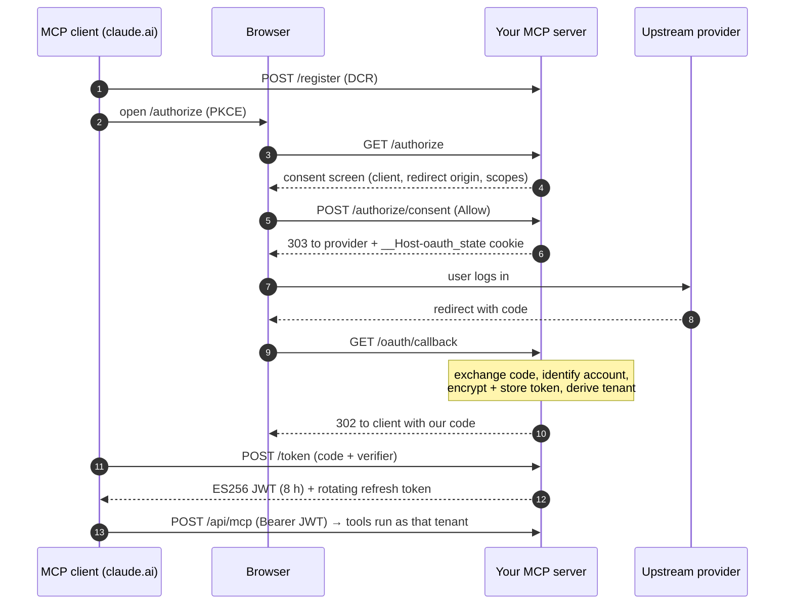

<p align="center">
  
</p>

<p align="center">
  <a href="README.md"></a>
  <a href="README.pt-BR.md"></a>
</p>

# MCP Turnkey

**Production-grade, multi-tenant MCP servers in Python — scaffolded in one command.**

[](template/pyproject.toml)
[](template/pyproject.toml)
[](template/docs/adr/0002-server-as-oauth-authorization-server.md)
[](LICENSE)

Most MCP server examples are single-user, stdio-only demos. The moment you want to put
one on the internet — so that *each user* connects *their own* account from claude.ai,
Claude Desktop or Claude Code — you need an OAuth 2.1 Authorization Server with Dynamic
Client Registration and PKCE, a consent screen against the "confused deputy" attack,
encrypted token storage, strict tenant isolation, and a pile of serverless gotchas
nobody writes down.

MCP Turnkey is that server, already built and tested. You run one command, get a
renamed copy wired to your provider, and spend your time on the tools — not on OAuth.

```bash
python scripts/scaffold.py --name acme-crm --title "Acme CRM"
# → ../mcp-acme-crm: package mcp_acme_crm, slug acme_crm, green test suite
```

## Why MCP Turnkey

**Build the tools — not the OAuth.** What sets it apart is the part almost nobody ships
ready-made:

1. **It solves the hard part of remote MCP.** For claude.ai to connect, your server has
   to be a complete OAuth 2.1 Authorization Server — discovery, Dynamic Client
   Registration, PKCE. Most examples are single-user stdio; this one is multi-tenant from
   day one, with every user connecting their own account.
2. **Security that is easy to miss, built in.**
   - Protection against the *confused deputy* attack, which the MCP specification requires
     and few starters implement.
   - Upstream tokens encrypted with AES-256-GCM, behind default-deny row-level security.
   - The tenant comes only from the credential, so no prompt can reach another user's data.
   - A STRIDE threat model that ships with every generated server.
3. **A real, tested server — not a code generator.** About 200 tests, including the whole
   OAuth flow without network, and CI proves on every push that a freshly generated
   project passes its own suite without a single edit.
4. **Production lessons, already paid for.**
   [`production-lessons.md`](docs/explanation/production-lessons.md) lists real failures
   and their fixes:
   - the 405 on GET that stops billing for idle SSE streams;
   - the 503 instead of 401 when the backend is down, so clients keep their good
     credentials;
   - the httpx logs that leaked tokens.

   The same CI blocked a dependency bump to `mcp` 2.x that would have broken every route.
5. **Built for coding agents.** A `CLAUDE.md`, Claude Code hooks, ADRs and specs travel
   with every generated server, so an agent such as Claude Code can extend it while
   keeping to the rules.

## What you get

A complete server (`template/`) that is a real, running MCP server — not a code
generator's Jinja soup — plus a standard-library scaffold that copies and renames it.

| | |
|---|---|
| **Multi-tenant by construction** | Tenant = `uuid5(server namespace, upstream account)`, taken only from the validated credential. No tool accepts a `tenant_id`, so no prompt can point at someone else's data. |
| **Its own OAuth 2.1 AS** | Discovery (RFC 9728 / 8414), Dynamic Client Registration (RFC 7591), PKCE S256, ES256 JWT access tokens, rotating hashed refresh tokens. Works with claude.ai custom connectors out of the box. |
| **Confused-deputy defense** | A per-client consent screen *before* the provider, showing the client, the redirect origin and the scopes; `__Host-` cookies bind the form and the `state` to the browser — as the MCP Security Best Practices require. |
| **Encrypted tokens** | Upstream tokens sealed with AES-256-GCM in Supabase (RLS default-deny); only ciphertext is ever cached. |
| **Serverless-ready** | Stateless streamable-HTTP transport on Vercel, 405 for GET (no billed idle SSE streams), daily cron that refreshes and validates every stored token. |
| **Hardened HTTP** | HSTS, CSP, `nosniff`, `X-Frame-Options`, `Referrer-Policy`, `Permissions-Policy`, `X-Request-ID` correlation, per-IP rate limits on every public OAuth route, schema-validated DCR. |
| **Safe tool patterns** | An example slice with a read, a write with `preview` and a destructive call that needs `confirm=true`, plus id patterns that block path smuggling. |
| **Local mode too** | The same tools over stdio for Claude Code / Claude Desktop, with a file-backed token. |
| **Quality gates** | `ruff` (incl. security rules), `mypy --strict`, ~200 tests (full OAuth flow, tenant isolation, consent, hardening, an end-to-end MCP call), `pip-audit` and `gitleaks` in CI. |
| **Docs as code** | Spec, threat model (STRIDE), 7 ADRs and Diátaxis docs that travel with every generated server — plus a `CLAUDE.md` and Claude Code hooks so coding agents follow the rules. |

## Quick start

Requirements: Python 3.10+ and git. No dependency is needed to run the scaffold.

```bash
git clone https://github.com/brunobracaioli/mcp-turnkey.git && cd mcp-turnkey
python scripts/scaffold.py --name acme-crm --title "Acme CRM"

cd ../mcp-acme-crm
python -m venv .venv && . .venv/bin/activate && pip install -e ".[dev]"
pytest -q && ruff check . && mypy src          # green before you change anything
git init && git add -A && git commit -m "chore: scaffold from MCP Turnkey"
```

**Prefer to let Claude Code do it?** Paste this prompt into
[Claude Code](https://claude.com/claude-code). It asks for the name, adapts the commands
to your OS (Linux, macOS, WSL or Windows) and stops before anything that is your decision
(provider, keys, deploy):

```text
Create a new MCP server from MCP Turnkey (https://github.com/brunobracaioli/mcp-turnkey).

1. Ask me for the server name (kebab-case, without "mcp-", e.g. acme-crm), its display
   title and where to create it (default: ~/projects).
2. Detect my OS and shell. Use `python3` if `python` is missing and confirm Python 3.10+.
   On WSL, work on the Linux filesystem (~), never under /mnt/c or /mnt/d. On native
   Windows, the venv lives in .venv\Scripts\, not .venv/bin/.
3. Clone the repository there and, from its root, run:
   python scripts/scaffold.py --name <name> --title "<title>"
4. In the generated project (../mcp-<name>): create .venv, run `pip install -e ".[dev]"`,
   then `ruff check . && ruff format --check . && mypy src && pytest -q`. Everything must
   be green before any change. If something fails, stop and show me the error — do not
   edit code to make it pass.
5. `git init`, `git add -A` and `git commit -m "chore: scaffold from MCP Turnkey"`. Do not
   add a remote or push.
6. Read the generated CLAUDE.md and list the SCAFFOLD: markers grouped by file, with one
   line on what each one decides. Then ask me about my provider (API base URL, OAuth
   endpoints, scopes). Do not fill markers, create .env files, generate keys or deploy
   without asking me.
```

The scaffold prints the `SCAFFOLD:` markers left for you — each one is a decision about
your provider (API base URL, OAuth endpoints, scopes, error envelope). Then:

1. Fill the spec in `docs/specs/mcp-acme-crm.md`.
2. Resolve the markers in `config.py` and `upstream_client.py`.
3. Replace the example `items` slice with your real tools
   ([how-to](template/docs/how-to/add-a-tool-slice.md)).
4. Try it locally over stdio ([tutorial](template/docs/tutorials/first-run-locally.md)),
   then [deploy to Vercel](template/docs/how-to/deploy-to-vercel.md) and add it as a
   custom connector in claude.ai.

Full walkthrough: [`docs/how-to/create-a-new-mcp.md`](docs/how-to/create-a-new-mcp.md).

## How a connection works



## Repository layout

```
template/              a complete MCP server (package mcp_bootstrap) — the thing you copy
  src/mcp_bootstrap/   domain · application · infrastructure · observability · server.py
  tests/               fakes for every port; the OAuth flow runs without network
  docs/                spec, threat model, ADRs, tutorials, how-tos, reference
  supabase/            the initial migration (RLS default-deny)
scripts/scaffold.py    copies template/ and renames every token (stdlib only)
tests/                 scaffold tests, including "the generated project passes its suite"
docs/                  why it is built this way, and how to evolve it
```

The stack is deliberately boring: the official `mcp` SDK (FastMCP), Starlette, httpx,
Pydantic, Vercel, Supabase and Upstash. Storage, cache and the upstream sit behind ports
(`domain/ports.py`), so swapping Supabase for another database is an adapter, not a
rewrite.

## Trade-offs

Honest limits, so you can decide quickly:

- **Opinionated stack.** Vercel, Supabase and Upstash out of the box. Storage, cache and
  the upstream sit behind ports, so swapping one is an adapter — but no other adapters
  ship today.
- **Stateless transport.** Every request is self-contained: no server-to-client
  notifications or SSE streams.
- **Generated servers own their code.** Later template improvements do not reach servers
  you already generated; port them by hand
  ([`production-lessons.md`](docs/explanation/production-lessons.md) lists what changed).
- **APIs without OAuth** (static tokens) need the
  [BYOT how-to](template/docs/how-to/switch-to-byot-login.md): a documented change, not a
  switch.

## Documentation

| | |
|---|---|
| Lessons from production that shaped the template | [`docs/explanation/production-lessons.md`](docs/explanation/production-lessons.md) |
| Why a living template instead of a generator | [`docs/explanation/why-a-living-template.md`](docs/explanation/why-a-living-template.md) |
| Create a new MCP server | [`docs/how-to/create-a-new-mcp.md`](docs/how-to/create-a-new-mcp.md) |
| Evolve the template itself | [`docs/how-to/evolve-the-template.md`](docs/how-to/evolve-the-template.md) |
| Scaffold contract | [`docs/specs/scaffold.md`](docs/specs/scaffold.md) |
| Decisions (this repository) | [`docs/adr/`](docs/adr/) |
| The generated server's docs | [`template/docs/`](template/docs/) — architecture, ADRs, threat model, HTTP/env/tool reference |

## Checks

```bash
(cd template && ruff check . && ruff format --check . && mypy src && pytest -q)
ruff check . && mypy && pytest -q    # scaffold, including an end-to-end generation
```

## Contributing and security

Contributions are welcome — read [`CONTRIBUTING.md`](CONTRIBUTING.md) first. Please report
vulnerabilities privately as described in [`SECURITY.md`](SECURITY.md).

## License

[MIT](LICENSE) © Bruno Bracaioli. Servers you generate with the scaffold are yours.
