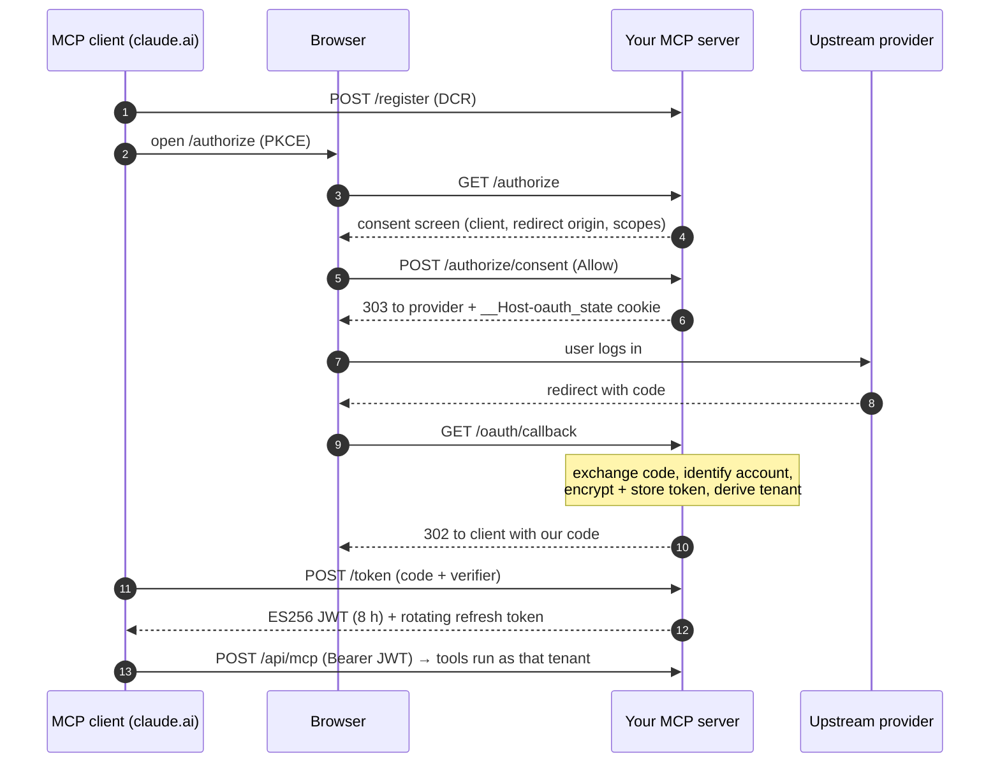

<p align="center">
  
</p>

# MCP Turnkey

**Production-grade, multi-tenant MCP servers in Python — scaffolded in one command.**

[](template/pyproject.toml)
[](template/pyproject.toml)
[](template/docs/adr/0002-server-as-oauth-authorization-server.md)
[](LICENSE)

[Português (Brasil)](README.pt-BR.md)

Most MCP server examples are single-user, stdio-only demos. The moment you want to put
one on the internet — so that *each user* connects *their own* account from claude.ai,
Claude Desktop or Claude Code — you need an OAuth 2.1 Authorization Server with Dynamic
Client Registration and PKCE, a consent screen against the "confused deputy" attack,
encrypted token storage, strict tenant isolation, and a pile of serverless gotchas
nobody writes down.

MCP Turnkey is that server, already built and tested. You run one command, get a
renamed copy wired to your provider, and spend your time on the tools — not on OAuth.

```bash
python scripts/scaffold.py --name acme-crm --title "Acme CRM"
# → ../mcp-acme-crm: package mcp_acme_crm, slug acme_crm, green test suite
```

## What you get

A complete server (`template/`) that is a real, running MCP server — not a code
generator's Jinja soup — plus a standard-library scaffold that copies and renames it.

| | |
|---|---|
| **Multi-tenant by construction** | Tenant = `uuid5(server namespace, upstream account)`, taken only from the validated credential. No tool accepts a `tenant_id`, so no prompt can point at someone else's data. |
| **Its own OAuth 2.1 AS** | Discovery (RFC 9728 / 8414), Dynamic Client Registration (RFC 7591), PKCE S256, ES256 JWT access tokens, rotating hashed refresh tokens. Works with claude.ai custom connectors out of the box. |
| **Confused-deputy defense** | A per-client consent screen *before* the provider, showing the client, the redirect origin and the scopes; `__Host-` cookies bind the form and the `state` to the browser — as the MCP Security Best Practices require. |
| **Encrypted tokens** | Upstream tokens sealed with AES-256-GCM in Supabase (RLS default-deny); only ciphertext is ever cached. |
| **Serverless-ready** | Stateless streamable-HTTP transport on Vercel, 405 for GET (no billed idle SSE streams), daily cron that refreshes and validates every stored token. |
| **Hardened HTTP** | HSTS, CSP, `nosniff`, `X-Frame-Options`, `Referrer-Policy`, `Permissions-Policy`, `X-Request-ID` correlation, per-IP rate limits on every public OAuth route, schema-validated DCR. |
| **Safe tool patterns** | An example slice with a read, a write with `preview` and a destructive call that needs `confirm=true`, plus id patterns that block path smuggling. |
| **Local mode too** | The same tools over stdio for Claude Code / Claude Desktop, with a file-backed token. |
| **Quality gates** | `ruff` (incl. security rules), `mypy --strict`, ~200 tests (full OAuth flow, tenant isolation, consent, hardening, an end-to-end MCP call), `pip-audit` and `gitleaks` in CI. |
| **Docs as code** | Spec, threat model (STRIDE), 7 ADRs and Diátaxis docs that travel with every generated server — plus a `CLAUDE.md` and Claude Code hooks so coding agents follow the rules. |

## Quick start

Requirements: Python 3.10+ and git. No dependency is needed to run the scaffold.

```bash
git clone https://github.com/brunobracaioli/mcp-turnkey.git && cd mcp-turnkey
python scripts/scaffold.py --name acme-crm --title "Acme CRM"

cd ../mcp-acme-crm
python -m venv .venv && . .venv/bin/activate && pip install -e ".[dev]"
pytest -q && ruff check . && mypy src          # green before you change anything
git init && git add -A && git commit -m "chore: scaffold from MCP Turnkey"
```

The scaffold prints the `SCAFFOLD:` markers left for you — each one is a decision about
your provider (API base URL, OAuth endpoints, scopes, error envelope). Then:

1. Fill the spec in `docs/specs/mcp-acme-crm.md`.
2. Resolve the markers in `config.py` and `upstream_client.py`.
3. Replace the example `items` slice with your real tools
   ([how-to](template/docs/how-to/add-a-tool-slice.md)).
4. Try it locally over stdio ([tutorial](template/docs/tutorials/first-run-locally.md)),
   then [deploy to Vercel](template/docs/how-to/deploy-to-vercel.md) and add it as a
   custom connector in claude.ai.

Full walkthrough: [`docs/how-to/create-a-new-mcp.md`](docs/how-to/create-a-new-mcp.md).

## How a connection works



## Repository layout

```
template/              a complete MCP server (package mcp_bootstrap) — the thing you copy
  src/mcp_bootstrap/   domain · application · infrastructure · observability · server.py
  tests/               fakes for every port; the OAuth flow runs without network
  docs/                spec, threat model, ADRs, tutorials, how-tos, reference
  supabase/            the initial migration (RLS default-deny)
scripts/scaffold.py    copies template/ and renames every token (stdlib only)
tests/                 scaffold tests, including "the generated project passes its suite"
docs/                  why it is built this way, and how to evolve it
```

The stack is deliberately boring: the official `mcp` SDK (FastMCP), Starlette, httpx,
Pydantic, Vercel, Supabase and Upstash. Storage, cache and the upstream sit behind ports
(`domain/ports.py`), so swapping Supabase for another database is an adapter, not a
rewrite.

## Documentation

| | |
|---|---|
| Lessons from production that shaped the template | [`docs/explanation/production-lessons.md`](docs/explanation/production-lessons.md) |
| Why a living template instead of a generator | [`docs/explanation/why-a-living-template.md`](docs/explanation/why-a-living-template.md) |
| Create a new MCP server | [`docs/how-to/create-a-new-mcp.md`](docs/how-to/create-a-new-mcp.md) |
| Evolve the template itself | [`docs/how-to/evolve-the-template.md`](docs/how-to/evolve-the-template.md) |
| Scaffold contract | [`docs/specs/scaffold.md`](docs/specs/scaffold.md) |
| Decisions (this repository) | [`docs/adr/`](docs/adr/) |
| The generated server's docs | [`template/docs/`](template/docs/) — architecture, ADRs, threat model, HTTP/env/tool reference |

## Checks

```bash
(cd template && ruff check . && ruff format --check . && mypy src && pytest -q)
ruff check . && mypy && pytest -q    # scaffold, including an end-to-end generation
```

## Contributing and security

Contributions are welcome — read [`CONTRIBUTING.md`](CONTRIBUTING.md) first. Please report
vulnerabilities privately as described in [`SECURITY.md`](SECURITY.md).

## License

[MIT](LICENSE) © Bruno Bracaioli. Servers you generate with the scaffold are yours.
