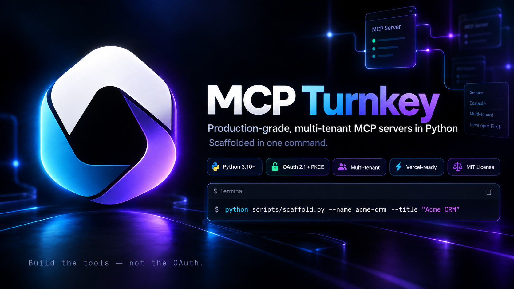
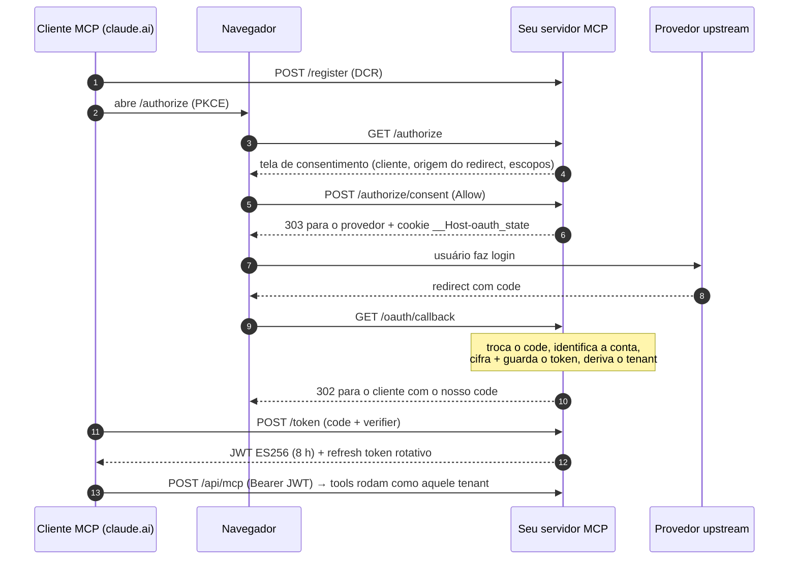

<p align="center">
  
</p>

<p align="center">
  <a href="README.md"></a>
  <a href="README.pt-BR.md"></a>
</p>

# MCP Turnkey

**Servidores MCP multi-tenant, prontos para produção, em Python — gerados com um comando.**

[](template/pyproject.toml)
[](template/pyproject.toml)
[](template/docs/adr/0002-server-as-oauth-authorization-server.md)
[](LICENSE)

A maioria dos exemplos de servidor MCP é demo de um usuário só, via stdio. Na hora em
que você quer colocar um na internet — para que *cada usuário* conecte *a própria*
conta pelo claude.ai, Claude Desktop ou Claude Code — você precisa de um Authorization
Server OAuth 2.1 com Dynamic Client Registration e PKCE, uma tela de consentimento
contra o ataque de "confused deputy", tokens cifrados, isolamento estrito entre tenants
e uma pilha de pegadinhas de serverless que ninguém documenta.

O MCP Turnkey é esse servidor, já construído e testado. Você roda um comando, recebe uma
cópia renomeada pronta para ligar no seu provedor e gasta seu tempo nas tools — não no
OAuth.

```bash
python scripts/scaffold.py --name acme-crm --title "Acme CRM"
# → ../mcp-acme-crm: pacote mcp_acme_crm, slug acme_crm, testes verdes
```

## Por que o MCP Turnkey

**Construa as tools — não o OAuth.** O diferencial está no que quase ninguém entrega
pronto:

1. **Resolve a parte difícil do MCP remoto.** Para o claude.ai conectar, o servidor
   precisa ser um Authorization Server OAuth 2.1 completo, com descoberta, Dynamic Client
   Registration e PKCE. A maioria dos exemplos é stdio para um usuário só; este já nasce
   multi-tenant, com cada usuário conectando a própria conta.
2. **Segurança que é fácil deixar passar, já embutida.**
   - Proteção contra o ataque de *confused deputy*, que a spec MCP exige e poucos
     templates implementam.
   - Tokens upstream cifrados com AES-256-GCM, atrás de row-level security default-deny.
   - O tenant vem só da credencial, então nenhum prompt alcança os dados de outro usuário.
   - Threat model STRIDE que acompanha cada servidor gerado.
3. **Um servidor de verdade, testado — não um gerador de código.** São cerca de 200
   testes, incluindo o fluxo OAuth inteiro sem rede, e o CI prova a cada push que um
   projeto recém-gerado passa nos próprios testes sem nenhuma edição.
4. **Lições de produção já pagas.**
   O [`production-lessons.md`](docs/explanation/production-lessons.md) lista falhas reais
   e suas correções:
   - o 405 no GET, que evita pagar por streams SSE ociosos;
   - o 503 em vez de 401 quando o backend cai, para o cliente não descartar uma
     credencial boa;
   - os logs do httpx que vazavam tokens.

   O mesmo CI barrou um bump de dependência para o `mcp` 2.x que quebraria todas as rotas.
5. **Feito para agentes de código.** `CLAUDE.md`, hooks do Claude Code, ADRs e specs
   acompanham cada servidor gerado, para que um agente como o Claude Code o evolua
   respeitando as regras.

## O que vem pronto

Um servidor completo (`template/`) que é um MCP de verdade, rodando — não uma sopa de
Jinja de gerador de código — mais um scaffold só com a biblioteca padrão que o copia e
renomeia.

| | |
|---|---|
| **Multi-tenant por construção** | Tenant = `uuid5(namespace do servidor, conta upstream)`, extraído só da credencial validada. Nenhuma tool aceita `tenant_id`, então nenhum prompt aponta para os dados de outra pessoa. |
| **O próprio AS OAuth 2.1** | Descoberta (RFC 9728 / 8414), Dynamic Client Registration (RFC 7591), PKCE S256, access token JWT ES256, refresh token com hash e rotação. Funciona com conectores customizados do claude.ai sem ajuste. |
| **Defesa contra confused deputy** | Tela de consentimento por cliente *antes* do provedor, mostrando o cliente, a origem do redirect e os escopos; cookies `__Host-` prendem o formulário e o `state` ao navegador — como pedem as Security Best Practices da spec MCP. |
| **Tokens cifrados** | Tokens upstream selados com AES-256-GCM no Supabase (RLS default-deny); só o texto cifrado vai para o cache. |
| **Pronto para serverless** | Transporte streamable-HTTP stateless na Vercel, 405 para GET (sem streams SSE ociosos faturados), cron diário que renova e valida todo token guardado. |
| **HTTP endurecido** | HSTS, CSP, `nosniff`, `X-Frame-Options`, `Referrer-Policy`, `Permissions-Policy`, correlação por `X-Request-ID`, rate limit por IP em toda rota OAuth pública, DCR validado por schema. |
| **Padrões seguros de tools** | Um slice de exemplo com leitura, escrita com `preview` e chamada destrutiva que exige `confirm=true`, além de padrões de id que bloqueiam path smuggling. |
| **Modo local também** | As mesmas tools via stdio para Claude Code / Claude Desktop, com token em arquivo. |
| **Portões de qualidade** | `ruff` (com regras de segurança), `mypy --strict`, ~200 testes (fluxo OAuth completo, isolamento de tenant, consentimento, hardening, uma chamada MCP de ponta a ponta), `pip-audit` e `gitleaks` no CI. |
| **Docs as code** | Spec, threat model (STRIDE), 7 ADRs e docs no formato Diátaxis que acompanham cada servidor gerado — mais um `CLAUDE.md` e hooks do Claude Code para que agentes de código sigam as regras. |

## Começo rápido

Requisitos: Python 3.10+ e git. O scaffold não precisa de nenhuma dependência.

```bash
git clone https://github.com/brunobracaioli/mcp-turnkey.git && cd mcp-turnkey
python scripts/scaffold.py --name acme-crm --title "Acme CRM"

cd ../mcp-acme-crm
python -m venv .venv && . .venv/bin/activate && pip install -e ".[dev]"
pytest -q && ruff check . && mypy src          # verde antes de mudar qualquer coisa
git init && git add -A && git commit -m "chore: scaffold from MCP Turnkey"
```

O scaffold lista os marcadores `SCAFFOLD:` que ficaram para você — cada um é uma decisão
sobre o seu provedor (URL base da API, endpoints OAuth, escopos, envelope de erro). Depois:

1. Preencha a spec em `docs/specs/mcp-acme-crm.md`.
2. Resolva os marcadores em `config.py` e `upstream_client.py`.
3. Troque o slice de exemplo `items` pelas suas tools reais
   ([how-to](template/docs/how-to/add-a-tool-slice.md)).
4. Teste localmente via stdio ([tutorial](template/docs/tutorials/first-run-locally.md)),
   depois [faça o deploy na Vercel](template/docs/how-to/deploy-to-vercel.md) e adicione
   como conector customizado no claude.ai.

Passo a passo completo: [`docs/how-to/create-a-new-mcp.md`](docs/how-to/create-a-new-mcp.md).
A documentação técnica está em inglês.

## Como funciona uma conexão



## Estrutura do repositório

```
template/              um servidor MCP completo (pacote mcp_bootstrap) — o que você copia
  src/mcp_bootstrap/   domain · application · infrastructure · observability · server.py
  tests/               fakes de cada porta; o fluxo OAuth roda sem rede
  docs/                spec, threat model, ADRs, tutoriais, how-tos, referência
  supabase/            a migration inicial (RLS default-deny)
scripts/scaffold.py    copia template/ e renomeia todos os tokens (só stdlib)
tests/                 testes do scaffold, incluindo "o projeto gerado passa na própria suíte"
docs/                  por que é construído assim e como evoluir
```

A stack é propositalmente sem surpresas: o SDK oficial `mcp` (FastMCP), Starlette, httpx,
Pydantic, Vercel, Supabase e Upstash. Armazenamento, cache e upstream ficam atrás de
portas (`domain/ports.py`), então trocar o Supabase por outro banco é um adaptador, não
uma reescrita.

## Limitações

Limites honestos, para você decidir rápido:

- **Stack opinativa.** Vercel, Supabase e Upstash prontos para uso. Armazenamento, cache e
  upstream ficam atrás de portas, então trocar um deles é escrever um adaptador — mas
  nenhum outro adaptador vem pronto hoje.
- **Transporte stateless.** Cada requisição é autocontida: não há notificações do servidor
  para o cliente nem streams SSE.
- **Servidores gerados são donos do próprio código.** Melhorias futuras do template não
  chegam sozinhas aos servidores já gerados; porte à mão (o
  [`production-lessons.md`](docs/explanation/production-lessons.md) lista o que mudou).
- **APIs sem OAuth** (tokens estáticos) precisam do
  [how-to de BYOT](template/docs/how-to/switch-to-byot-login.md): uma mudança documentada,
  não uma chave liga/desliga.

## Checks

```bash
(cd template && ruff check . && ruff format --check . && mypy src && pytest -q)
ruff check . && mypy && pytest -q    # scaffold, incluindo uma geração de ponta a ponta
```

## Contribuição e segurança

Contribuições são bem-vindas — leia o [`CONTRIBUTING.md`](CONTRIBUTING.md) antes.
Vulnerabilidades devem ser reportadas de forma privada, como descrito no
[`SECURITY.md`](SECURITY.md).

## Licença

[MIT](LICENSE) © Bruno Bracaioli. Os servidores que você gerar com o scaffold são seus.
